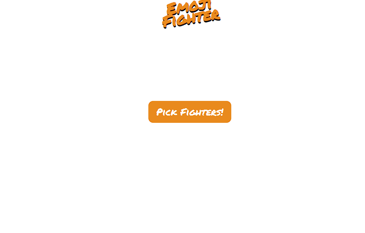
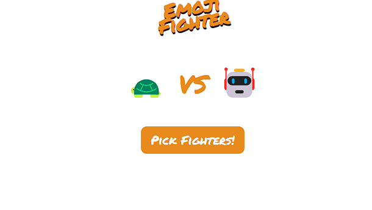

# Emoji Fighter App

A fun Emoji Fighter Game built with HTML, CSS, and JavaScript.

## Project Description
This project is a simple and entertaining game where two random emoji fighters are selected to face off in a battle. The game is built using HTML for the structure, CSS for styling, and JavaScript for the logic that powers the random selection of emoji fighters.

## Features
* Randomly selects two emoji fighters when the "Pick Fighters!" button is clicked.
* Displays the selected fighters on the stage for a fun visual battle.
* Simple and playful design with custom fonts and colors.

## Installation
To run this project locally, clone the repository and open the index.html file in your web browser.

```bash
git clone https://github.com/Adlichalbi/EmojiFighter.git
cd emoji-fighter-game
open index.html
```

## Usage
1. Open the index.html file in your web browser.
2. Click the "Pick Fighters!" button to randomly select and display two emoji fighters on the stage.
3. Enjoy the fun and randomness of each battle!

## Technologies Used
* HTML: For the game structure.
* CSS: For styling the game interface, including custom fonts and colors.
* JavaScript: For selecting random emoji fighters and updating the game stage.

## Screenshots




## License

This project is open source and available under the MIT License.

## Contact
If you have any questions or suggestions, feel free to reach out.

